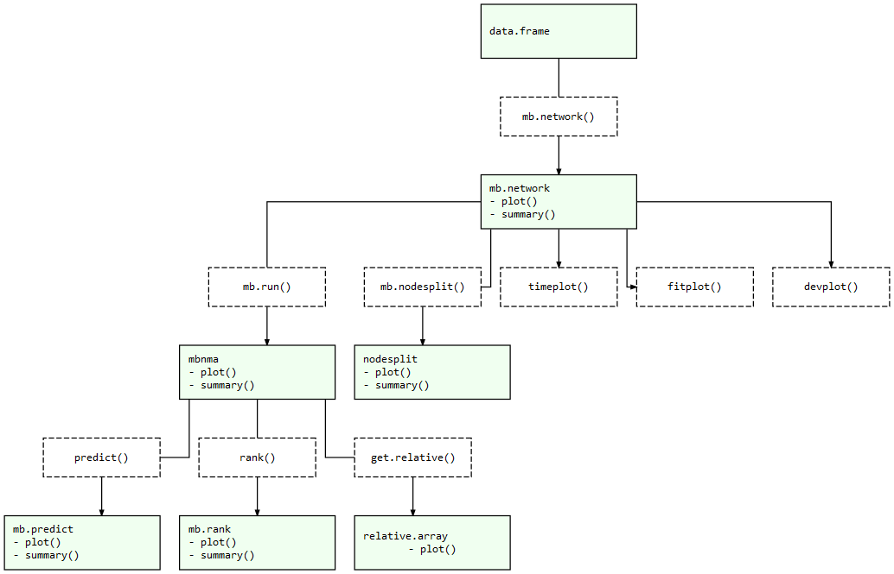

<!-- README.md is generated from README.Rmd. Please edit that file -->

<!-- badges: start -->

[](https://CRAN.R-project.org/package=MBNMAtime)
[](https://travis-ci.org/hugaped/MBNMAtime)
<!--[](https://github.com/hugaped/MBNMAtime/actions)-->
<!-- badges: end -->

# MBNMAtime

The goal of `MBNMAtime` is to provide a collection of useful commands
that allow users to run time-course Model-Based Network Meta-Analysis
(MBNMA). This allows meta-analysis of studies with multiple follow-up
measurements that can account for time-course for a single or multiple
treatment comparisons.

Including all available follow-up measurements within a study makes use
of all the available evidence in a way that maintains connectivity
between treatments, and it does so in a way that explains time-course,
thus explaining heterogeneity and inconsistency that may be present in a
standard Network Meta-Analysis (NMA). All models and analyses are
implemented in a Bayesian framework, following an extension of the
standard NMA methodology presented by Lu and Ades (2004) and are run in
JAGS (JAGS Computer Program 2017). For full details of time-course MBNMA
methodology see Pedder et al. (2019).

## Installation

Currently the package can be installed directly from GitHub using the
`devtools` R package:

``` r
# First install devtools
install.packages("devtools")

# Then install MBNMAtime directly from GitHub
devtools::install_github("hugaped/MBNMAtime")
```

Once it is released on CRAN (i.e. **not yet\!**), you will (hopefully)
be able to install the released version of `MBNMAtime` from
[CRAN](https://CRAN.R-project.org) with:

``` r
install.packages("MBNMAtime")
```

## Workflow

Functions within `MBNMAtime` follow a clear pattern of use:

1.  Load your data into the correct format using `mb.network()`
2.  Specify a suitable time-course function and analyse your data using
    `mb.run()`
3.  Test for consistency using functions like `mb.nodesplit()`
4.  Examine model results using forest plots and treatment rankings
5.  Use your model to predict responses using `predict()`

At each of these stages there are a number of informative plots that can
be generated to help make sense of your data and the models that you are
fitting. Exported functions in the package are connected like so:

*MBNMAtime package structure: Light green nodes represent classes and
the generic functions that can be applied to them. Dashed boxes indicate
functions that can be applied to objects of specific classes*


## References

<div id="refs" class="references">

<div id="ref-jags">

JAGS Computer Program. 2017. <https://mcmc-jags.sourceforge.io/>.

</div>

<div id="ref-lu2004">

Lu, G., and A. E. Ades. 2004. “Combination of Direct and Indirect
Evidence in Mixed Treatment Comparisons.” Journal Article. *Stat Med* 23
(20): 3105–24. <https://doi.org/10.1002/sim.1875>.

</div>

<div id="ref-pedder2019">

Pedder, H., S. Dias, M. Bennetts, M. Boucher, and N. J. Welton. 2019.
“Modelling Time-Course Relationships with Multiple Treatments:
Model-Based Network Meta-Analysis for Continuous Summary Outcomes.”
Journal Article. *Res Synth Methods* 10 (2): 267–86.

</div>

</div>
